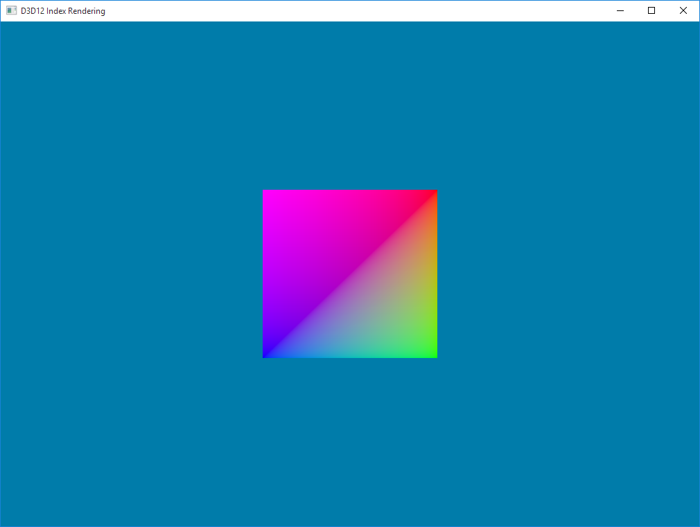

# D3D12-Demos
A collection of demos using various aspects of the D3D12 API.

## [IndexRendering](IndexRendering/)

This demo shows how to create an index buffer resource, copy the index data to the GPU's Default Heap for long term storage, and create an Index Buffer View to be used with the Input Assembler.

Additional Features:
* Precompiled shaders
* sRGB Render Target View for gamma correction
* CommandList resuse

## [InstanceRendering](InstanceRendering/)
Shows how to preflight rendered frames on the CPU which will then be processed by the GPU. Fences are used to synchronize shared resources between CPU and GPU
