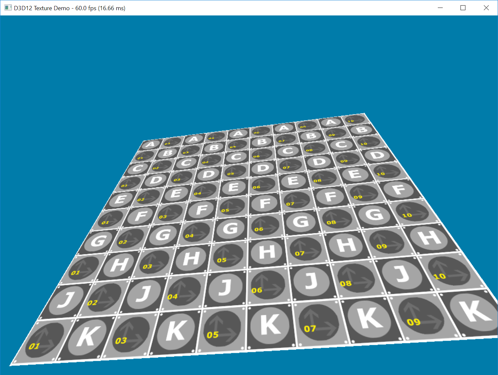

# D3D12-Demos
A collection of demos using various aspects of the D3D12 API.

## [IndexRendering](IndexRendering/)

This demo shows how to create an index buffer resource, copy the index data to the GPU's Default Heap for long term storage, and create an Index Buffer View to be used with the Input Assembler.

Additional Features:
* Precompiled shaders
* sRGB Render Target View for gamma correction

## [ConstantBuffer](ConstantBuffer/)

Uses multiple upload heap buffers to manage constant buffer data that is updated per frame.  

Constant buffer data such as cube rotation angle changes each frame, where as other data such as light position remains contant each frame.

## [Texture](Texture/)

Shows how to load data from a png file, setup a static sampler for sampling the texture within a pixel shader, and setting the root signature to referencce the descriptor heap containing the texture SRV (Shader Resource View).
